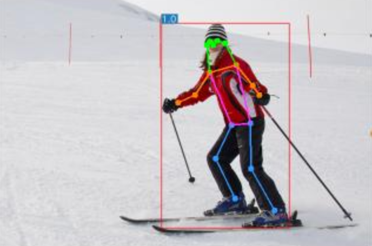

# Investigation on the Effectiveness of Tools for Optimizing YOLOv7 Training Performance

Implementation of Pietro Santandreas's Master Thesis - [Investigation on the Effectiveness of Tools for Optimizing Object Detector Training Performance](https://drive.google.com/file/d/1vU1hcDD94EkHLp1kBoUp6L8vFKTtT03F/view?usp=sharing)

## Overview

This repository contains the implementation of the Thesis mentioned above. This work was carried out at the DLR (German Aerospace Center) and focused on tools for optimizing training performance. The model used was YOLOv7 ([link here](https://github.com/WongKinYiu/yolov7)), and the tools in focus were Data Augmentation, Dropout Regularization, and Hard Examples Mining. The raw results can be seen [here](scripts/results.xlsx).

## Results Table

| Model | Description | P-Bike | P-Car | P-Lorry | P-Bus | P-Pedestrian | mAP@.5 | mAP@.5:.95 |
| :-- | :-- | :-: | :-: | :-: | :-: | :-: | :-: | :-: |
[**M0**](https://github.com/WongKinYiu/yolov7/releases/download/v0.1/yolov7.pt) | No Augmentations | 0.555 | 0.908 | 0.768 | 0.740 | 0.278 | **0.652** | 0.396 |
[**M1**](https://github.com/WongKinYiu/yolov7/releases/download/v0.1/yolov7.pt) | Spatial | 0.675 | 0.923 | 0.800 | 0.790 | 0.375 | **0.677** | 0.410 |
[**M2**](https://github.com/WongKinYiu/yolov7/releases/download/v0.1/yolov7.pt) | Color | 0.563 | 0.900 | 0.755 | 0.575 | 0.290 | **0.627** | 0.373 |
[**M3**](https://github.com/WongKinYiu/yolov7/releases/download/v0.1/yolov7.pt) | Spatial<br>Color | 0.643 | 0.915 | 0.785 | 0.715 | 0.315 | **0.655** | 0.392 |
[**M4**](https://github.com/WongKinYiu/yolov7/releases/download/v0.1/yolov7.pt) | Spatial<br>Color<br>Mosaic | 0.740 | 0.940 | 0.885 | 0.860 | 0.460 | **0.762** | 0.475 |
[**M4.1**](https://github.com/WongKinYiu/yolov7/releases/download/v0.1/yolov7.pt) | Spatial<br>Mosaic | 0.735 | 0.940 | 0.890 | 0.888 | 0.473 | **0.767** | 0.475 |
[**M5**](https://github.com/WongKinYiu/yolov7/releases/download/v0.1/yolov7.pt) | M4.1 setup<br>Dropout | 0.710 | 0.935 | 0.850 | 0.775 | 0.408 | **0.732** | 0.446 |
[**M6**](https://github.com/WongKinYiu/yolov7/releases/download/v0.1/yolov7.pt) | M5 setup<br>+100 Hard Samples | 0.748 | 0.950 | 0.888 | 0.883 | 0.558 | **0.790** | 0.492 |
[**M6.1**](https://github.com/WongKinYiu/yolov7/releases/download/v0.1/yolov7.pt) | M4.1 setup<br>+100 Hard Samples | 0.773 | 0.950 | 0.893 | 0.858 | 0.598 | **0.803** | 0.507 |
[**M7**](https://github.com/WongKinYiu/yolov7/releases/download/v0.1/yolov7.pt) | M5 setup<br>+100 Random Samples | 0.708 | 0.948 | 0.885 | 0.860 | 0.460 | **0.770** | 0.488 |
    
## Other Trained Models

<details>
<summary>Click to expand</summary>

| Model | Description | P-Bike | P-Car | P-Lorry | P-Bus | P-Pedestrian | mAP@.5 | mAP@.5:.95 |
| :-- | :-- | :-: | :-: | :-: | :-: | :-: | :-: | :-: |
[**M4.2**](https://github.com/WongKinYiu/yolov7/releases/download/v0.1/yolov7.pt) | Mosaic | 0.710 | 0.930 | 0.870 | 0.890 | 0.460 | **0.747** | 0.460 |
[**M4.3**](https://github.com/WongKinYiu/yolov7/releases/download/v0.1/yolov7.pt) | M4.1 Setup<br>Mixup | 0.750 | 0.940 | 0.870 | 0.840 | 0.480 | **0.768** | 0.474 |
[**M5.1**](https://github.com/WongKinYiu/yolov7/releases/download/v0.1/yolov7.pt) | M4.1 Setup<br>DropBlock  | 0.788 | 0.950 | 0.905 | 0.885 | 0.540 | **0.798** | 0.510 |
[**M6.2**](https://github.com/WongKinYiu/yolov7/releases/download/v0.1/yolov7.pt) | M4.1 Setup<br>+100 Max Hard Samples | 0.643 | 0.915 | 0.785 | 0.715 | 0.315 | **0.655** | 0.392 |
[**M6.3**](https://github.com/WongKinYiu/yolov7/releases/download/v0.1/yolov7.pt) | M4.1 Setup<br>+200 Hard Samples | 0.798 | 0.953 | 0.890 | 0.890 | 0.620 | **0.809** | 0.509 |
[**M6.4**](https://github.com/WongKinYiu/yolov7/releases/download/v0.1/yolov7.pt) | M4.1 Setup<br>+100 Entropy Images | 0.780 | 0.950 | 0.878 | 0.883 | 0.593 | **0.803** | 0.507 |
[**M8**](https://github.com/WongKinYiu/yolov7/releases/download/v0.1/yolov7.pt) | M4.1 setup<br>All images | 0.870 | 0.960 | 0.920 | 0.890 | 0.690 | **0.878** | 0.582 |
   


Docker environment (recommended)
<details><summary> <b>Expand</b> </summary>

``` shell
# create the docker container, you can change the share memory size if you have more.
nvidia-docker run --name yolov7 -it -v your_coco_path/:/coco/ -v your_code_path/:/yolov7 --shm-size=64g nvcr.io/nvidia/pytorch:21.08-py3

# apt install required packages
apt update
apt install -y zip htop screen libgl1-mesa-glx

# pip install required packages
pip install seaborn thop

# go to code folder
cd /yolov7
```

</details>

## Testing

[`yolov7.pt`](https://github.com/WongKinYiu/yolov7/releases/download/v0.1/yolov7.pt) [`yolov7x.pt`](https://github.com/WongKinYiu/yolov7/releases/download/v0.1/yolov7x.pt) [`yolov7-w6.pt`](https://github.com/WongKinYiu/yolov7/releases/download/v0.1/yolov7-w6.pt) [`yolov7-e6.pt`](https://github.com/WongKinYiu/yolov7/releases/download/v0.1/yolov7-e6.pt) [`yolov7-d6.pt`](https://github.com/WongKinYiu/yolov7/releases/download/v0.1/yolov7-d6.pt) [`yolov7-e6e.pt`](https://github.com/WongKinYiu/yolov7/releases/download/v0.1/yolov7-e6e.pt)

``` shell
python test.py --data data/coco.yaml --img 640 --batch 32 --conf 0.001 --iou 0.65 --device 0 --weights yolov7.pt --name yolov7_640_val
```

You will get the results:

```
 Average Precision  (AP) @[ IoU=0.50:0.95 | area=   all | maxDets=100 ] = 0.51206
 Average Precision  (AP) @[ IoU=0.50      | area=   all | maxDets=100 ] = 0.69730
 Average Precision  (AP) @[ IoU=0.75      | area=   all | maxDets=100 ] = 0.55521
 Average Precision  (AP) @[ IoU=0.50:0.95 | area= small | maxDets=100 ] = 0.35247
 Average Precision  (AP) @[ IoU=0.50:0.95 | area=medium | maxDets=100 ] = 0.55937
 Average Precision  (AP) @[ IoU=0.50:0.95 | area= large | maxDets=100 ] = 0.66693
 Average Recall     (AR) @[ IoU=0.50:0.95 | area=   all | maxDets=  1 ] = 0.38453
 Average Recall     (AR) @[ IoU=0.50:0.95 | area=   all | maxDets= 10 ] = 0.63765
 Average Recall     (AR) @[ IoU=0.50:0.95 | area=   all | maxDets=100 ] = 0.68772
 Average Recall     (AR) @[ IoU=0.50:0.95 | area= small | maxDets=100 ] = 0.53766
 Average Recall     (AR) @[ IoU=0.50:0.95 | area=medium | maxDets=100 ] = 0.73549
 Average Recall     (AR) @[ IoU=0.50:0.95 | area= large | maxDets=100 ] = 0.83868
```

To measure accuracy, download [COCO-annotations for Pycocotools](http://images.cocodataset.org/annotations/annotations_trainval2017.zip) to the `./coco/annotations/instances_val2017.json`

## Training

Data preparation

``` shell
bash scripts/get_coco.sh
```

* Download MS COCO dataset images ([train](http://images.cocodataset.org/zips/train2017.zip), [val](http://images.cocodataset.org/zips/val2017.zip), [test](http://images.cocodataset.org/zips/test2017.zip)) and [labels](https://github.com/WongKinYiu/yolov7/releases/download/v0.1/coco2017labels-segments.zip). If you have previously used a different version of YOLO, we strongly recommend that you delete `train2017.cache` and `val2017.cache` files, and redownload [labels](https://github.com/WongKinYiu/yolov7/releases/download/v0.1/coco2017labels-segments.zip) 

Single GPU training

``` shell
# train p5 models
python train.py --workers 8 --device 0 --batch-size 32 --data data/coco.yaml --img 640 640 --cfg cfg/training/yolov7.yaml --weights '' --name yolov7 --hyp data/hyp.scratch.p5.yaml

# train p6 models
python train_aux.py --workers 8 --device 0 --batch-size 16 --data data/coco.yaml --img 1280 1280 --cfg cfg/training/yolov7-w6.yaml --weights '' --name yolov7-w6 --hyp data/hyp.scratch.p6.yaml
```

Multiple GPU training

``` shell
# train p5 models
python -m torch.distributed.launch --nproc_per_node 4 --master_port 9527 train.py --workers 8 --device 0,1,2,3 --sync-bn --batch-size 128 --data data/coco.yaml --img 640 640 --cfg cfg/training/yolov7.yaml --weights '' --name yolov7 --hyp data/hyp.scratch.p5.yaml

# train p6 models
python -m torch.distributed.launch --nproc_per_node 8 --master_port 9527 train_aux.py --workers 8 --device 0,1,2,3,4,5,6,7 --sync-bn --batch-size 128 --data data/coco.yaml --img 1280 1280 --cfg cfg/training/yolov7-w6.yaml --weights '' --name yolov7-w6 --hyp data/hyp.scratch.p6.yaml
```

## Transfer learning

[`yolov7_training.pt`](https://github.com/WongKinYiu/yolov7/releases/download/v0.1/yolov7_training.pt) [`yolov7x_training.pt`](https://github.com/WongKinYiu/yolov7/releases/download/v0.1/yolov7x_training.pt) [`yolov7-w6_training.pt`](https://github.com/WongKinYiu/yolov7/releases/download/v0.1/yolov7-w6_training.pt) [`yolov7-e6_training.pt`](https://github.com/WongKinYiu/yolov7/releases/download/v0.1/yolov7-e6_training.pt) [`yolov7-d6_training.pt`](https://github.com/WongKinYiu/yolov7/releases/download/v0.1/yolov7-d6_training.pt) [`yolov7-e6e_training.pt`](https://github.com/WongKinYiu/yolov7/releases/download/v0.1/yolov7-e6e_training.pt)

Single GPU finetuning for custom dataset

``` shell
# finetune p5 models
python train.py --workers 8 --device 0 --batch-size 32 --data data/custom.yaml --img 640 640 --cfg cfg/training/yolov7-custom.yaml --weights 'yolov7_training.pt' --name yolov7-custom --hyp data/hyp.scratch.custom.yaml

# finetune p6 models
python train_aux.py --workers 8 --device 0 --batch-size 16 --data data/custom.yaml --img 1280 1280 --cfg cfg/training/yolov7-w6-custom.yaml --weights 'yolov7-w6_training.pt' --name yolov7-w6-custom --hyp data/hyp.scratch.custom.yaml
```

## Re-parameterization

See [reparameterization.ipynb](tools/reparameterization.ipynb)

## Inference

On video:
``` shell
python detect.py --weights yolov7.pt --conf 0.25 --img-size 640 --source yourvideo.mp4
```

On image:
``` shell
python detect.py --weights yolov7.pt --conf 0.25 --img-size 640 --source inference/images/horses.jpg
```

<div align="center">
    <a href="./">
        
    </a>
</div>


## Export

**Pytorch to CoreML (and inference on MacOS/iOS)** <a href="https://colab.research.google.com/github/WongKinYiu/yolov7/blob/main/tools/YOLOv7CoreML.ipynb"></a>

**Pytorch to ONNX with NMS (and inference)** <a href="https://colab.research.google.com/github/WongKinYiu/yolov7/blob/main/tools/YOLOv7onnx.ipynb"></a>
```shell
python export.py --weights yolov7-tiny.pt --grid --end2end --simplify \
        --topk-all 100 --iou-thres 0.65 --conf-thres 0.35 --img-size 640 640 --max-wh 640
```

**Pytorch to TensorRT with NMS (and inference)** <a href="https://colab.research.google.com/github/WongKinYiu/yolov7/blob/main/tools/YOLOv7trt.ipynb"></a>

```shell
wget https://github.com/WongKinYiu/yolov7/releases/download/v0.1/yolov7-tiny.pt
python export.py --weights ./yolov7-tiny.pt --grid --end2end --simplify --topk-all 100 --iou-thres 0.65 --conf-thres 0.35 --img-size 640 640
git clone https://github.com/Linaom1214/tensorrt-python.git
python ./tensorrt-python/export.py -o yolov7-tiny.onnx -e yolov7-tiny-nms.trt -p fp16
```

**Pytorch to TensorRT another way** <a href="https://colab.research.google.com/gist/AlexeyAB/fcb47ae544cf284eb24d8ad8e880d45c/yolov7trtlinaom.ipynb"></a> <details><summary> <b>Expand</b> </summary>


```shell
wget https://github.com/WongKinYiu/yolov7/releases/download/v0.1/yolov7-tiny.pt
python export.py --weights yolov7-tiny.pt --grid --include-nms
git clone https://github.com/Linaom1214/tensorrt-python.git
python ./tensorrt-python/export.py -o yolov7-tiny.onnx -e yolov7-tiny-nms.trt -p fp16

# Or use trtexec to convert ONNX to TensorRT engine
/usr/src/tensorrt/bin/trtexec --onnx=yolov7-tiny.onnx --saveEngine=yolov7-tiny-nms.trt --fp16
```

</details>

Tested with: Python 3.7.13, Pytorch 1.12.0+cu113

## Pose estimation

[`code`](https://github.com/WongKinYiu/yolov7/tree/pose) [`yolov7-w6-pose.pt`](https://github.com/WongKinYiu/yolov7/releases/download/v0.1/yolov7-w6-pose.pt)

See [keypoint.ipynb](https://github.com/WongKinYiu/yolov7/blob/main/tools/keypoint.ipynb).

<div align="center">
    <a href="./">
        
    </a>
</div>


## Instance segmentation (with NTU)

[`code`](https://github.com/WongKinYiu/yolov7/tree/mask) [`yolov7-mask.pt`](https://github.com/WongKinYiu/yolov7/releases/download/v0.1/yolov7-mask.pt)

See [instance.ipynb](https://github.com/WongKinYiu/yolov7/blob/main/tools/instance.ipynb).

<div align="center">
    <a href="./">
        
    </a>
</div>

## Instance segmentation

[`code`](https://github.com/WongKinYiu/yolov7/tree/u7/seg) [`yolov7-seg.pt`](https://github.com/WongKinYiu/yolov7/releases/download/v0.1/yolov7-seg.pt)

YOLOv7 for instance segmentation (YOLOR + YOLOv5 + YOLACT)

| Model | Test Size | AP<sup>box</sup> | AP<sub>50</sub><sup>box</sup> | AP<sub>75</sub><sup>box</sup> | AP<sup>mask</sup> | AP<sub>50</sub><sup>mask</sup> | AP<sub>75</sub><sup>mask</sup> |
| :-- | :-: | :-: | :-: | :-: | :-: | :-: | :-: |
| **YOLOv7-seg** | 640 | **51.4%** | **69.4%** | **55.8%** | **41.5%** | **65.5%** | **43.7%** |

## Anchor free detection head

[`code`](https://github.com/WongKinYiu/yolov7/tree/u6) [`yolov7-u6.pt`](https://github.com/WongKinYiu/yolov7/releases/download/v0.1/yolov7-u6.pt)

YOLOv7 with decoupled TAL head (YOLOR + YOLOv5 + YOLOv6)

| Model | Test Size | AP<sup>val</sup> | AP<sub>50</sub><sup>val</sup> | AP<sub>75</sub><sup>val</sup> |
| :-- | :-: | :-: | :-: | :-: |
| **YOLOv7-u6** | 640 | **52.6%** | **69.7%** | **57.3%** |


## Citation

```
@inproceedings{wang2023yolov7,
  title={{YOLOv7}: Trainable bag-of-freebies sets new state-of-the-art for real-time object detectors},
  author={Wang, Chien-Yao and Bochkovskiy, Alexey and Liao, Hong-Yuan Mark},
  booktitle={Proceedings of the IEEE/CVF Conference on Computer Vision and Pattern Recognition (CVPR)},
  year={2023}
}
```

```
@article{wang2023designing,
  title={Designing Network Design Strategies Through Gradient Path Analysis},
  author={Wang, Chien-Yao and Liao, Hong-Yuan Mark and Yeh, I-Hau},
  journal={Journal of Information Science and Engineering},
  year={2023}
}
```


## Teaser

YOLOv7-semantic & YOLOv7-panoptic & YOLOv7-caption

<div align="center">
    <a href="./">
        
    </a>
    <a href="./">
        
    </a>
    <a href="./">
        
    </a>
    <a href="./">
        
    </a>
</div>

YOLOv7-semantic & YOLOv7-detection & YOLOv7-depth (with NTUT)

<div align="center">
    <a href="./">
        
    </a>
</div>

YOLOv7-3d-detection & YOLOv7-lidar & YOLOv7-road (with NTUT)

<div align="center">
    <a href="./">
        
    </a>
    <a href="./">
        
    </a>
    <a href="./">
        
    </a>
</div>


## Acknowledgements

<details><summary> <b>Expand</b> </summary>

* [https://github.com/AlexeyAB/darknet](https://github.com/AlexeyAB/darknet)
* [https://github.com/WongKinYiu/yolor](https://github.com/WongKinYiu/yolor)
* [https://github.com/WongKinYiu/PyTorch_YOLOv4](https://github.com/WongKinYiu/PyTorch_YOLOv4)
* [https://github.com/WongKinYiu/ScaledYOLOv4](https://github.com/WongKinYiu/ScaledYOLOv4)
* [https://github.com/Megvii-BaseDetection/YOLOX](https://github.com/Megvii-BaseDetection/YOLOX)
* [https://github.com/ultralytics/yolov3](https://github.com/ultralytics/yolov3)
* [https://github.com/ultralytics/yolov5](https://github.com/ultralytics/yolov5)
* [https://github.com/DingXiaoH/RepVGG](https://github.com/DingXiaoH/RepVGG)
* [https://github.com/JUGGHM/OREPA_CVPR2022](https://github.com/JUGGHM/OREPA_CVPR2022)
* [https://github.com/TexasInstruments/edgeai-yolov5/tree/yolo-pose](https://github.com/TexasInstruments/edgeai-yolov5/tree/yolo-pose)

</details>
